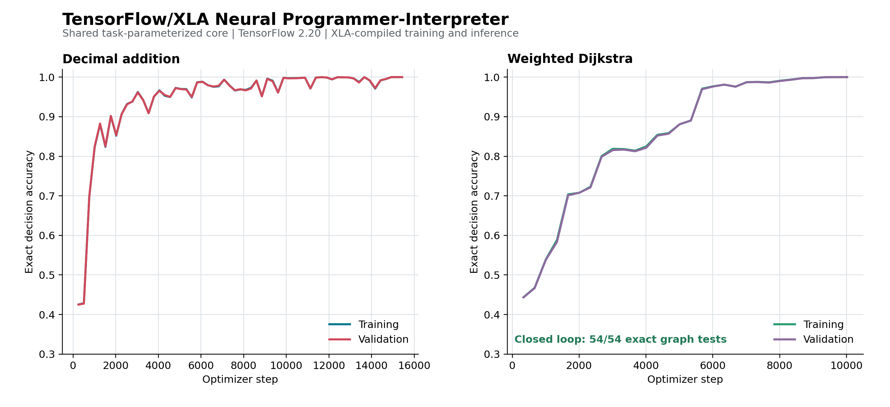

# TensorFlow/XLA Neural Programmer-Interpreter

A modern, task-parameterized implementation of Reed and de Freitas' [Neural Programmer-Interpreters](https://arxiv.org/abs/1511.06279). The supported codebase uses TensorFlow 2.20 and XLA for training and recursive neural inference.

The repository includes two task plugins:

- Decimal addition with dynamic scratchpads
- Weighted single-source shortest paths learned as hierarchical linear-scan Dijkstra



## Design

The shared core has no hard-coded task programs or action arguments. Each task supplies a `TaskSpec` containing:

```text
observation size
program vocabulary size
action program
root program
number and depth of argument heads
default arguments
return-before-call or return-after-call semantics
```

This supports action spaces with different arities and vocabularies. Addition uses three argument heads; Dijkstra uses four. A custom task can choose any number of heads. Training uses constant-rate AdamW by default (`learning_rate=3e-4`, `weight_decay=1e-4`); there is no learning-rate schedule.

```text
npi/
  core/
    spec.py          Task and environment contracts
    traces.py        Generic hierarchical supervision
    codec.py         Observation/argument encoding
    data.py          Padded power-of-two buckets
    model.py         Shared TensorFlow NPI
    trainer.py       XLA loss, optimizer, and metrics
    runtime.py       Scalar and batched recursive execution
    checkpoint.py    TensorFlow weight persistence
    hardware.py      CPU/GPU selection
  tasks/
    addition/        Addition plugin
    graph/           Dijkstra plugin and multi-GPU sweep
  cli.py             Unified command line
```

See [architecture.md](docs/architecture.md) and [adding_a_task.md](docs/adding_a_task.md).

## Environment

Python 3.12 is required. The exact dependency graph is in `uv.lock`.

```bash
uv sync --frozen
```

Or use Conda:

```bash
conda env create -f environment.yml
conda activate neural-programmer-interpreter
```

Verify TensorFlow and GPU visibility:

```bash
uv run python -c \
  'import tensorflow as tf; print(tf.__version__, tf.config.list_physical_devices("GPU"))'
```

TensorFlow's `and-cuda` extra installs its CUDA 12 user-space libraries. The host still needs a compatible NVIDIA driver.

## Tests

```bash
TF_CPP_MIN_LOG_LEVEL=2 uv run python -m unittest discover -v
```

The tests execute reference traces, arbitrary task specifications, shared sequence/step recurrence, padded masks, batched failure isolation, and a real XLA optimizer update.

## Addition

Train:

```bash
uv run python main.py addition train \
  --maximum-train-length 20 \
  --examples-per-length 32 \
  --epochs 80
```

Evaluate:

```bash
uv run python main.py addition evaluate \
  --lengths 1,10,100,1000 \
  --evaluation-examples 10
```

Measured native TensorFlow run:

```text
Training invocations:       63,837
Training decisions:         108,816
Convergence:                step 15,433
Train decision accuracy:    100%
Validation decision accuracy: 100%
Closed-loop evaluation:     32/32
Maximum tested digits:      1,000
```

## Weighted Dijkstra

Train:

```bash
uv run python main.py graph train \
  --maximum-train-nodes 10 \
  --epochs 100
```

Evaluate:

```bash
uv run python main.py graph evaluate \
  --evaluation-nodes 5,10,20 \
  --evaluation-examples 3 \
  --evaluation-maximum-weight 50
```

Measured native TensorFlow run:

```text
Training graphs:             288
Training invocations:        84,150
Training decisions:          168,012
Convergence:                 step 10,020
Train decision accuracy:     100%
Validation decision accuracy: 100%
Closed-loop graph tests:     54/54
```

The graph network predicts fixed register, field, and opcode symbols. It never predicts node IDs, edge IDs, distances, weights, or memory addresses.

## Multi-GPU Sweep

```bash
uv run python main.py graph-sweep \
  --gpu-count 8 \
  --maximum-train-nodes 5,10,15,20 \
  --seeds 1,2 \
  --checkpoint-steps 1000,2000,4000,8000,12000,20000,30000,40000,50000,60000 \
  --generalization-nodes 10,20,30,40,50,75,100,125,150,200 \
  --execution-batch-size 100 \
  --learning-rate 3e-4 \
  --weight-decay 1e-4
```

Each `(maximum training nodes, seed)` run occupies one isolated TensorFlow GPU worker. Up to 100 recursive environments share each XLA model call. Every reported capacity requires 100/100 exact distance arrays and valid shortest-path parent trees. See [hpc_sweep.md](docs/hpc_sweep.md).

## Weight Video

Retrain while rendering one frame every 50 optimizer steps:

```bash
uv run python main.py graph-weight-video \
  --maximum-train-nodes 30 \
  --steps 120000 \
  --frame-interval 50 \
  --output artifacts/graph_random_weight_evolution.mp4
```

The raster has exactly one pixel per trainable parameter. Pixel locations remain fixed, and color represents absolute weight magnitude under one fixed logarithmic scale. A JSON sidecar records the frame-to-step mapping, color transform, and variable offsets.

## Artifacts

```text
artifacts/addition.weights.h5
artifacts/addition.weights.json
artifacts/addition_results.json
artifacts/graph_dijkstra/best.weights.h5
artifacts/graph_dijkstra/best.weights.json
artifacts/graph_dijkstra/evaluation.json
artifacts/tensorflow_xla_results.png
artifacts/tensorflow_xla_results.pdf
```
