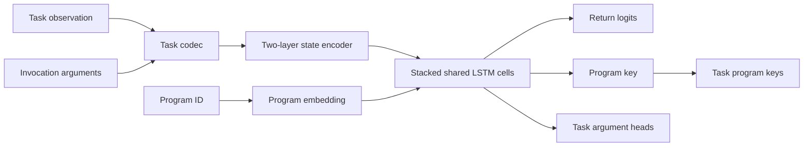

# TensorFlow/XLA Architecture

## Shared Model

`NeuralProgrammerInterpreter` receives a `TaskSpec`. Program keys, embeddings, and argument heads are allocated from that specification. Sequence training and recursive inference call the same `LSTMCell` objects; tests verify exact equivalence.

## XLA

`Trainer.train_step` and `Trainer.eval_step` are `tf.function(jit_compile=True)` functions. Recursive model steps are also XLA compiled. Environment state transitions remain explicit task plugins because actions are discrete and are not differentiated.

Power-of-two length buckets replace exact-length microbatches. A sequence mask excludes padding from return, program, argument, and exact-decision metrics. Optimization uses constant-rate Adam with a configurable L1 loss penalty by default. Learning rate, L1, L2, and optional decoupled weight decay are explicit task-run parameters; only one regularization method may be enabled per run.

## Recursion

Every invocation starts with independent zero LSTM state. The caller's updated state remains stored while the child runs. `TaskSpec.return_before_call` declares whether a positive return decision terminates immediately or after the predicted child. This distinction is task-level data rather than executor-specific code.

Training resume uses one TensorFlow object checkpoint containing the model, Adam slots, and iteration counter. Recurrent cells and argument heads are directly tracked model attributes, and optimizer slots are built before restoration. TensorFlow must report full checkpoint consumption and the optimizer iteration must equal the recorded step; resume fails rather than continuing from partial state if either check disagrees. H5 files are inference exports and are never read by resume logic.

The batched runtime stores one explicit Python call stack per environment and stacks active TensorFlow states for a shared XLA call. Invalid actions or observations fail only their own execution.

## Task Boundaries

A task owns:

- program and action enums;
- `TaskSpec`;
- environment and local observation;
- codec;
- reference hierarchical traces;
- problem generation and correctness oracle;
- optional task CLI.

The core owns:

- model construction;
- padded batching;
- losses and exact metrics;
- XLA compilation;
- recursion semantics;
- checkpoint persistence;
- hardware configuration.
