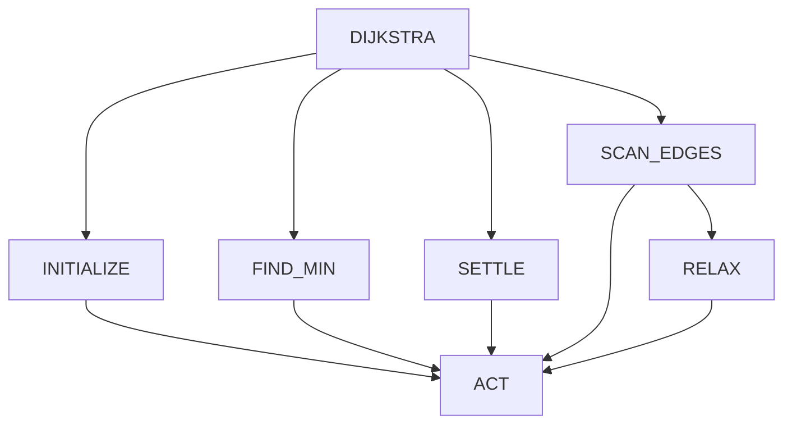

# Weighted Dijkstra Program Hierarchy

The model manipulates fixed pointer and value registers through eight generic opcodes: `COPY_PTR`, `FOLLOW_PTR`, `READ_VAL`, `WRITE_PTR`, `WRITE_VAL`, `WRITE_BIT`, `ADD_VAL`, and `CMP_VAL`.

The environment owns linked node and edge records. The network never predicts graph-size-dependent addresses or numeric distances. The graph `TaskSpec` defines seven programs and four argument heads with depths `(8, 26, 26, 26)`.

Training graphs are independent weighted connected Erdos-Renyi samples. For `n` nodes, the generator samples `G(n, p)` with `p = min(0.25, 2 log(n) / n)`, rejects disconnected samples, and assigns independent positive edge weights. Hand-designed path, star, sparse, dense, disconnected, and directed families remain available for targeted evaluation.

See [architecture.md](architecture.md) for the shared TensorFlow/XLA core and [hpc_sweep.md](hpc_sweep.md) for capacity experiments.
