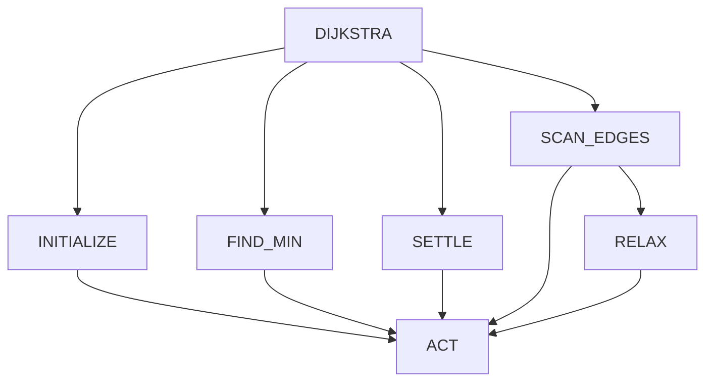

# Pointer-Machine NPI for Weighted Dijkstra

## Problem

The model computes single-source shortest-path distances on nonnegative weighted graphs using the linear-scan form of Dijkstra's algorithm. It also writes a valid shortest-path parent tree.

## Environment

The environment stores linked node and edge records. It owns pointer and scalar values; the model only predicts fixed register and field symbols.

Node fields:

```text
next_node, first_edge, distance, parent, settled
```

Edge fields:

```text
next_edge, neighbor, weight
```

Pointer registers:

```text
FIRST, SOURCE, U, V, NODE, BEST, EDGE, NULL
```

Scalar registers:

```text
D_U, D_V, D_BEST, WEIGHT, CANDIDATE, ZERO, INFINITY
```

The state encoder sees only pointer-null flags, settled bits under selected pointers, comparison flags, and current program arguments. It never sees or predicts a node ID, edge ID, address, distance, or weight.

## Primitive Actions

```text
COPY_PTR
FOLLOW_PTR
READ_VAL
WRITE_PTR
WRITE_VAL
WRITE_BIT
ADD_VAL
CMP_VAL
```

These are generic pointer-machine operations. The environment does not implement minimum extraction, edge relaxation, graph scanning, settling, or shortest paths.

## Learned Programs



`FIND_MIN` learns the full unsettled-node scan and comparison logic. `RELAX` learns to read `distance[U]`, read the edge weight and `distance[V]`, construct the candidate, compare it, and conditionally write distance and parent fields.

## Training

```text
Node counts:             2 through 10
Examples per node count: 32
Graphs:                  288
Weight range:            1 through 9
Hierarchical invocations: 84,150
Supervised decisions:     168,012
Optimizer:                Adam with warmup and exponential decay
Exact train accuracy:     100%
Exact held-out accuracy:  100%
Convergence step:         10,469
```

## Closed-Loop Evaluation

```text
Maximum nodes:            100
Maximum edge weight:      100
Families:                 path, star, sparse, dense, disconnected, directed
Problems:                 150
Exact distance arrays:    150 / 150
Valid parent trees:       150 / 150
```

Directed graphs were not present in training. The larger tests use fewer samples, so the 100% result is a measured result for this suite rather than a population-level accuracy estimate.

## Commands

```bash
uv run python -m modern_npi.graph.experiment reproduce
uv run python -m modern_npi.graph.plot_results
```

Artifacts are under `artifacts/graph_dijkstra/`.

## Capacity Sweep

`modern_npi.graph.generalization_sweep` measures the maximum verified node count as training progresses. For each maximum training size and exact optimizer-step checkpoint, it evaluates ascending node-count candidates. A candidate passes only if 100/100 deterministic-randomized closed-loop executions produce exact oracle distances and valid parent trees. The first failed candidate terminates that checkpoint's search, which makes the reported capacity a conservative contiguous bound.

Independent `(maximum training nodes, seed)` jobs are distributed across `--gpu-count` worker processes. Evaluation uses a dynamic batched recursive executor: every graph retains an independent call stack and LSTM state per invocation, while active interpreters share each GPU forward pass.

```bash
uv run python -m modern_npi.graph.generalization_sweep \
  --gpu-count 8 \
  --maximum-train-nodes 5,10,15,20 \
  --seeds 1,2 \
  --checkpoint-steps 1000,2000,4000,6000,8000,10000,12000 \
  --generalization-nodes 10,20,30,40,50,75,100,125,150,200
```

Use at least as many training-size/seed combinations as GPU workers for full utilization. Model snapshots are compact; one separate optimizer checkpoint per run supports `--resume`.
