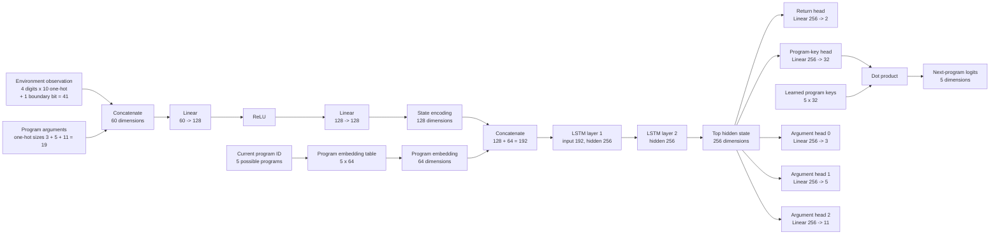

# NPI Neural Network Architecture

```mermaid
flowchart LR
    OBS["Environment observation<br/>4 digits x 10 one-hot<br/>+ 1 boundary bit = 41"]
    ARGS["Program arguments<br/>one-hot sizes 3 + 5 + 11 = 19"]

    OBS --> INPUT["Concatenate<br/>60 dimensions"]
    ARGS --> INPUT

    INPUT --> FC1["Linear<br/>60 -> 128"]
    FC1 --> RELU["ReLU"]
    RELU --> FC2["Linear<br/>128 -> 128"]
    FC2 --> STATE["State encoding<br/>128 dimensions"]

    PID["Current program ID<br/>5 possible programs"]
    PID --> EMB["Program embedding table<br/>5 x 64"]
    EMB --> PROG["Program embedding<br/>64 dimensions"]

    STATE --> JOIN["Concatenate<br/>128 + 64 = 192"]
    PROG --> JOIN

    JOIN --> LSTM1["LSTM layer 1<br/>input 192, hidden 256"]
    LSTM1 --> LSTM2["LSTM layer 2<br/>hidden 256"]
    LSTM2 --> H["Top hidden state<br/>256 dimensions"]

    H --> END["Return head<br/>Linear 256 -> 2"]

    H --> KEY["Program-key head<br/>Linear 256 -> 32"]
    KEY --> DOT["Dot product"]
    PKEYS["Learned program keys<br/>5 x 32"] --> DOT
    DOT --> NEXT["Next-program logits<br/>5 dimensions"]

    H --> ARG0["Argument head 0<br/>Linear 256 -> 3"]
    H --> ARG1["Argument head 1<br/>Linear 256 -> 5"]
    H --> ARG2["Argument head 2<br/>Linear 256 -> 11"]
```

Total trainable parameters: **1,025,557**.
