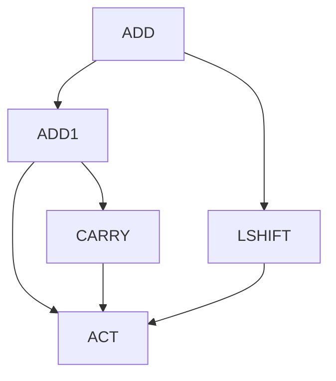

# Addition Program Hierarchy

The implementation uses the shared TensorFlow/XLA core described in [architecture.md](architecture.md). Addition's `TaskSpec` defines five programs, a 41-value local observation, and three argument heads with depths `(3, 5, 11)`.
